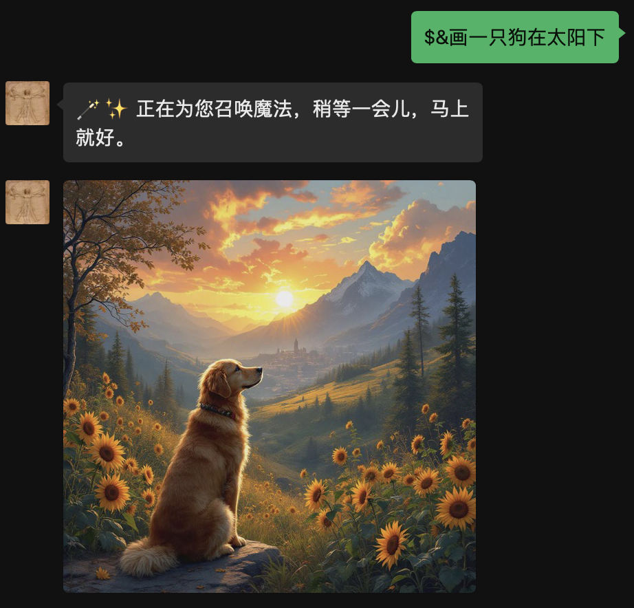
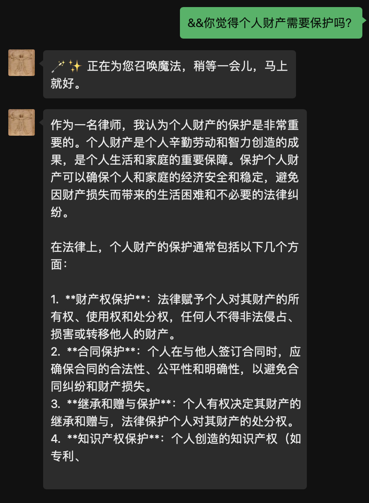

# keyword_call
可用于dify-on-wechat和chatgpt-on-wechat的插件，可设置多个关键字，根据不同关键字调用不同的API


0.0.2已发布，支持文生图时自动翻译成英文后再生成图片，支持返回多张图片

当前支持三种调用方式，一是兼容openai的api，二是支持dify的api，三是兼容cloudflare的文生图接口，后续再持续增加api接入及完善


效果如下图
<div align="center">

</div>

<div align="center">

</div>


安装后，记得cp config.json.template config.json

config.json 配置说明
```bash
{
  "#invoking_reply#": "🪄✨ 正在为您召唤魔法，稍等一会儿，马上就好。",
  "#error_reply#": "😮‍💨看起来像是服务器在做深呼吸，稍等一下，它会回来的。",
  "#translator#":{
      "api_type": "openai",
      "open_ai_api_base":"https://api.cloudflare.com/client/v4/accounts/account_id/ai/run/@cf/meta/m2m100-1.2b",
      "open_ai_api_key":"api-key",
      "open_ai_model":"model",
      "prompt": ""
  },
  "translator_openai":{
      "api_type": "openai",
      "open_ai_api_base":"https://api.cloudflare.com/client/v4/accounts/account_id/ai/run/@cf/meta/m2m100-1.2b",
      "open_ai_api_key":"api-key",
      "open_ai_model":"model",
      "to_lang": "english"
  },
  "$$":{
        "api_type": "cf-image",
        "open_ai_api_base": "https://api.cloudflare.com/client/v4/accounts/account_id/ai/run/@cf/black-forest-labs/flux-1-schnell",
        "open_ai_api_key":  "api-key",
        "open_ai_model": "@cf/bytedance/stable-diffusion-xl-lightning",
        "prompt":  "A realistic and highly detailed scene",
        "translator": "translator_cf"
  },
  "&&":{
        "api_type": "openai",
        "open_ai_api_base": "https://api.cloudflare.com/client/v4/accounts/account_id/ai/v1/chat/completions",
        "open_ai_api_key":  "api-key",
        "open_ai_model": "@cf/meta/llama-3.1-70b-instruct",
        "prompt":  "你是一个专业的律师，你给提供专业的法律意见",
        "translator": "translator_openai"
  },
  "query":{
        "api_type": "dify",
        "open_ai_api_base": "服务地址/v1/chat-messages",
        "open_ai_api_key":  "app-xxxxxxxxxxxxxxxxxxxxx",
        "open_ai_model": "",
        "prompt":  "你是一个数据总结专家",
        "translator": ''
  }
}


```


